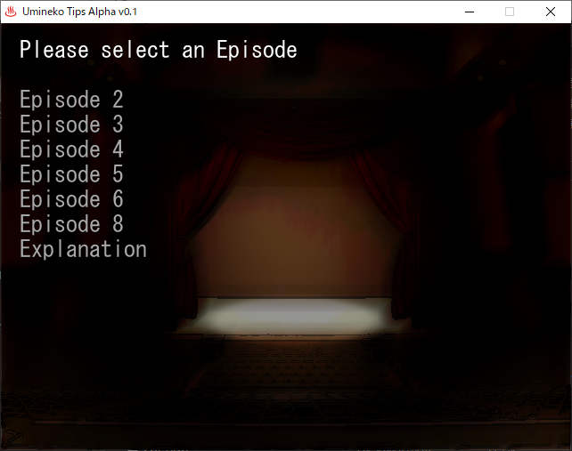
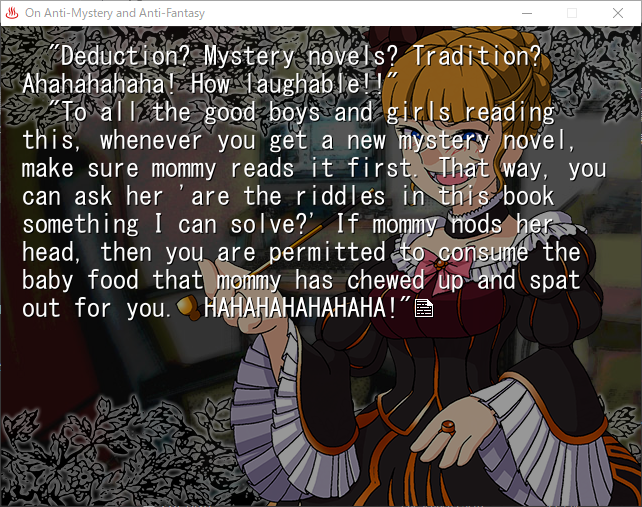
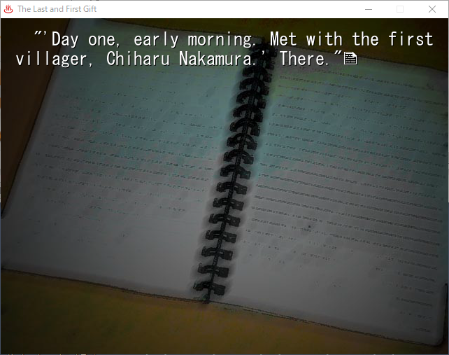

# UmiTips

Happy Umineko Day, 2026-10-04!

## Table of Contents

- [UmiTips](#umitips)
	- [Table of Contents](#table-of-contents)
	- [About this Project](#about-this-project)
	- [Installation](#installation)
	- [Screenshots](#screenshots)

## About this Project

To the best of my knowledge, **NO MACHINE TRANSLATION OR ANY OTHER FORM OF GENERATIVE AI WAS USED IN THIS PROJECT**. Should I learn that any of the existing translations I have adapted were created with MTL, I will promptly remove them and see to it that they are given a fresh, human translation. 

There are two main goals for this project:

1) Create new VN adaptations for the two Umineko tips that never received them
2) Port the console exclusive tips from Umineko Saku Sw/PS4 to ONSEN

## Installation

Simply download the latest release from the [releases](https://github.com/bTuberBilly/umitips/releases) tab, extract the files into a folder of your choosing, and launch `Umineko Tips.exe`.

## Screenshots

